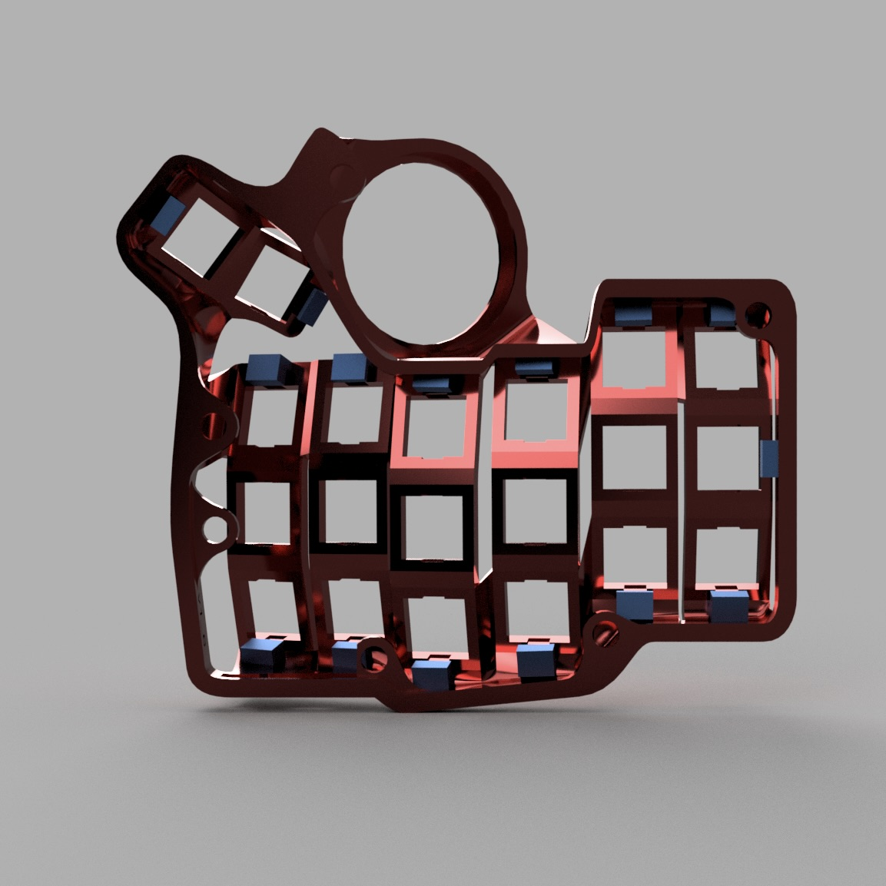

# Snap Fit Cases for Charybdis Mini and Charybdis Nano

Charybdis is an ergonomic, open source keyboard designed and developed by [Bastardkb](https://github.com/Bastardkb/Charybdis).

The conventional build for the Charybdis line of keyboards is to solder the switches to the PCB. This helps to hold the PCB firmly in place. To make the Charybdis hot swappable, some force is required to keep the PCB pushed against the keyboard case. Using copious amounts of hot glue and/or tape is one option to achieve this. Another way is to handwire each switch. These solutions seemed cumbersome to me.

My contribution towards this project is the addition of snap fits to secure the PCB provided by [Bastard Keyboards](https://bastardkb.com/). This repository contains files for the right and left cases for the "Mini" and "Nano" versions of Charybdis.

### CHARYBDIS MINI SNAP FIT CASE (RIGHT)

